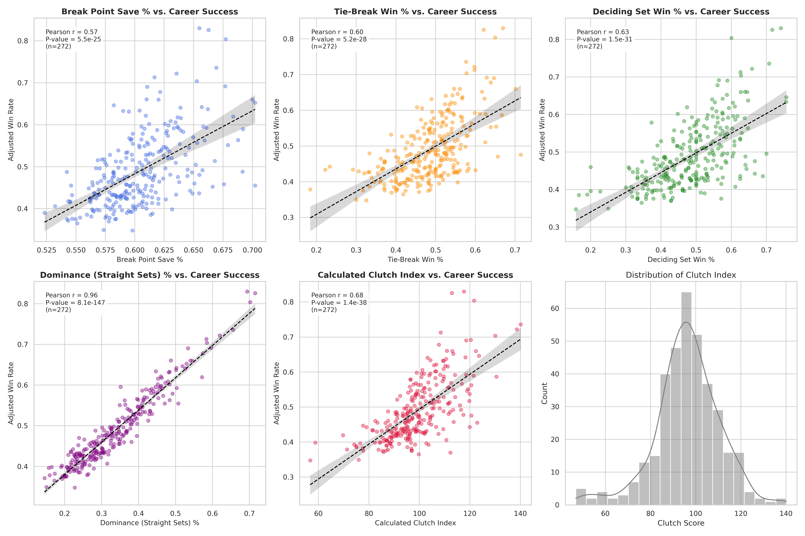
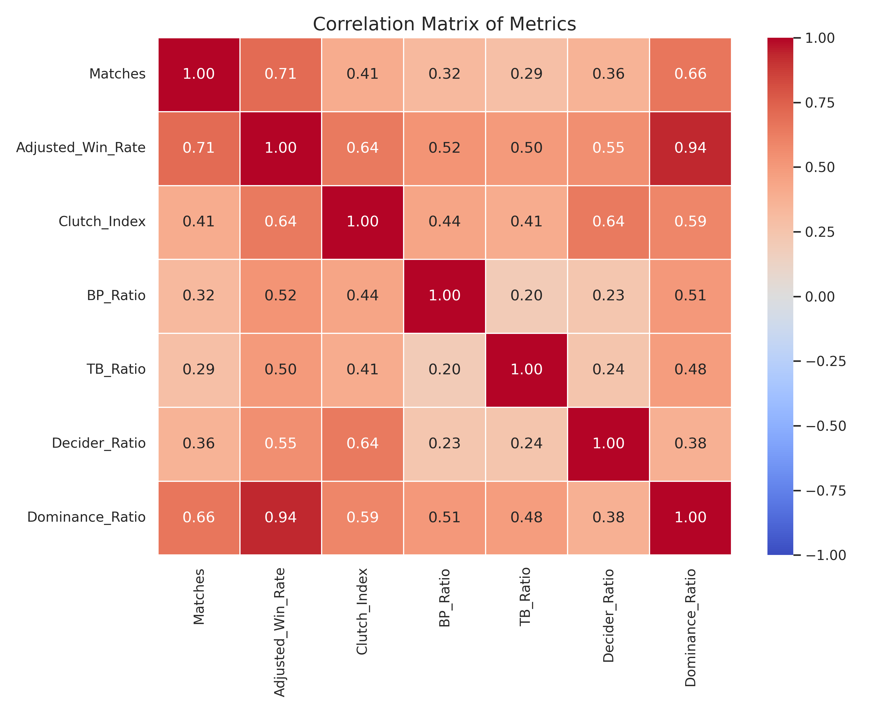

# DSA 210 Project Proposal: The Correlation Between "Clutch" Performance and Career Success in ATP Tennis

## 1. Project Proposal and Motivation
 This project seeks to analyze the relationship between a professional tennis players ability to perform successfully under high pressure scenarios referred to here as "Clutchness" and their overall long-term career success. As a long time tennis watcher I realized that big comebacks in games were the best to watch such as 2025 Roland Garros Final the comeback of Alcaraz from 3 championship point was unbelivable. These matches are not only continuing for long hours with pure enjoyment, they are also best with the high competition because tennis players in these matches are battling through everything, people who are watching can see the all blood,sweat and the tears of tennis players. Therefore, I thought that why did not I make project from comebacks of tennis and I decided on effects of "Clutchness" on Career Wins of tennis players.

## 2. Research Question and Hypotheses

### Research Question
 If we can quantify the Clutchness of a player, does it can correlate with the success metrics (measured by total titles, win percentage and average ranking)?

### Null Hypothesis ($H_0$)
 The quantified measure of the Clutchness Index can not show any significant correlation with the success metrics of a player.
### Alternative Hypothesis ($H_a$)
 The quantified measure of the Clutchness Index is positively correlated with the success metrics of a player.
 
## 3. Data Sources and Scope 
 ### Data Source
 The dataset will be mainly from "Jeff Sackmann" https://github.com/jeffsackmann and https://www.tennisabstract.com/ which the website also has related github repos and also more detailed informations that I can use for calculation of metrics.
 ### Data Scope
 The Data will contain matches from 2000-2025 for only Men's Singles. I will not include Women's Singles the reason behind is, there is no consistency in winners and some like Maria Sharapova and Simona Halep tested doping positive and also I am not familiar with WTA level tennis for that many long time, therefore I am not including the Women's Singles. 

## 4. Data Cleaning and Preparation

To ensure high data quality and relevance, the following preprocessing steps were applied:

1.  **Tournament Filtering:** * The dataset was filtered to **exclude** lower tier events (ATP 250 and ATP 500).
    * The analysis is restricted to **ATP Masters 1000** and **Grand Slam** tournaments. This ensures the analysis focuses on peak competitive performance where "clutch" moments are most critical.

2.  **Handling Missing Values (Imputation):**
    * Missing numerical data points (`N/A`) were imputed using the **mean** value of their respective features. 

## 5. Methodology

### 1. The "Clutch Index" Measure 
A custom-engineered metric designed to quantify a player's mental fortitude. The index is a weighted aggregate of the following components:
* **Break Point Resilience (%40):** Weighted ratio of break points saved and faced .
* **Tie-Break Performance (%20):** Win rate in tie-breaks.
* **Deciding Set (%20):** Win rate in final sets (3rd set in Masters, 5th set in Slams).
* **Comeback Bonus:** Bonus points for recovering from 0-1 or 0-2 set deficits.
* **Dominance Bonus:** Recognizes that winning in straight sets (avoiding "clutch" moments entirely) is a skill. Players like Nadal/Federer receive points for "clean" wins.
* **Longevity Bonus:** Logarithmic scaling to reward players who maintain high performance over hundreds of matches vs. short-term outliers.

### 2. Bayesian Adjusted Win Rate ️
* **Problem:** A rookie with a 2-0 record (100%) should not be ranked higher than a legend with a 800-200 record (80%).
* **Solution:** The algorithm "dampens" the win rate towards the global average (50%) by adding a "confidence weight" (C=50 matches).
* **Formula:** `(Wins + 25) / (Matches + 50)`

### 3. Statistical Hypothesis Testing 
* **Pearson Correlation:** Calculates the strength and direction of the linear relationship between the *Clutch Index* and *Adjusted Win Rate*.
* **P-Value Interpretation:** Automatically evaluates statistical significance (alpha = 0.05) and points to rejecting or failing to reject the Null Hypothesis ($H_0$).
* **p-value Hypothesis Testing:** We performed a Pearson Correlation Test to validate our results.
  Results:Correlation Coefficient (r): 0.642P-Value: 1.44e-43 (<< 0.05)
  Result: We reject the Null Hypothesis. The data provides strong evidence that clutch performance is linked to winning more matches over a career.
  
### 4.Visualizations & Analysis
* **Component Analysis:**
The scatter plots below show how individual clutch metrics correlate with career success. Note the strong linearity in Dominance Ratio and Deciding Set Win %.

* **Correlation Matrix:**
A heatmap displaying the relationships between all calculated features.

## 6. Exploratory Data Analysis (EDA) 

Before finalizing the *Clutch Index*, we analyzed the relationship between individual performance metrics and career success. The analysis of over 26,000 matches revealed several key patterns.

### 1. Component Correlation Analysis
We visualized individual components against the **Adjusted Win Rate** to understand which factors contribute most to a player's success.

**Key Observations:**
1.  **Dominance is Key ($r=0.96$):** The strongest predictor of career success isn't actually winning close matches, but **winning easily** (Dominance Ratio). Players who win in straight sets consistently have the highest career win rates.
2.  **Pressure Performance:**
    * **Deciding Set Win % ($r=0.63$):** Winning the final set (3rd or 5th) has a very strong positive correlation with overall success.
    * **Tie-Break Win % ($r=0.60$):** Ability to close out tight sets is an indicator of top tier players.
    * **Break Point Save % ($r=0.57$):** While important, saving break points correlates slightly less with success than winning deciders, suggesting that *avoiding* break points (via Dominance) is preferable to *saving* them.

### 2. Feature Correlation Heatmap
To ensure our *Clutch Index* wasn't redundant, we checked multicollinearity between features.

* **Clutch Index Validity:** The calculated `Clutch_Index` has a correlation of **0.64** with `Adjusted_Win_Rate`, confirming that our formula successfully captures a signal relevant to winning, separate from just raw dominance.
* **Independence:** Most individual clutch metrics (like TB Ratio and BP Ratio) have low correlation with each other ($r \approx 0.20$), indicating they measure different aspects of a player's mental game.

### C. Distribution of Clutch Scores
The calculated **Clutch Index** follows a near-normal distribution centered around a score of 100, with a slight right skew. This suggests that "extreme clutch" performance (scores > 120) is a rare trait possessed by only the elite tier of ATP players (The Big Three).

## 7. Machine Learning Application
 To analyze clutch performance under pressure, the following machine learning techniques were applied:
 
### Unsupervised Learning (Clustering):

K-Means clustering (k = 3) was applied to segment players into distinct clutch profiles.
Clusters were interpreted based on average career win rate within each group:

The cluster with the highest mean win rate was labeled Elite Clutch

The intermediate cluster was labeled Moderate Clutch

The lowest-performing cluster was labeled Low Clutch

### Impact Analysis:

A composite Clutch Score was computed as the mean of offensive and defensive clutch rates.
Its relationship with career win rate was evaluated using Pearson's correlation and linear regression.

## 8. Findings 

 Personally, I was expecting this result more or less. It has been a great fun to do this project maybe If I create a better Clutch Index with parameters the result may result in a more parallel way with my expectation or thoughts but I believe that it is still a good result and showing prominence. As a Result we can clearly say that being a Clutch player is an important factor to win titles but It will not be enough itself there should be talent as well as Clutchness, also we can divide this clutch performance to other groups some of them can be good in defence some in attack and some in both.

## 9. Limitations

 I think in terms of raw primary data there was not a limitations for this project but if you want to look deeper for example in matches the player can change the style of how he receive the ball or can change the direction of the shot it can be crosscourt it can be down the line so to some extent we can have more information to play which is in my opinion can have lots of meaning and these meanings can supply us more accurate calculation in the clutch performance.
 Also one last limitation that I can think is that I am not very familiar with women's tennis so this project only included men's tennis so also inclusion of the women's tennis would be nice, but for this project I think if I included the women's tennis then the result would be more different because the preperation of the calculation metrics was all about trial and error so If I really don't know the player then I can not comment on it.

## 9. Future Work

  Adding women's tennis (WTA) will be good, also from the data that will retrieved from tennisabstract.com may lead to more accurate calculations there are tons of data there. There might be usage of different Machine Learning models. However, If I decide to continue to do commits for this project I will go with probably retrieving the data from tennisabstract.com and will experiment on posititoning of the player, Changes in the shot direction etc. 

## 10. AI Usage 

 In this project, I used Gemini for the coding part and for some parts in the readme.MD for a clearance. Finding all prompts that I have used is a bit hard because I also tried other things that I may think to use in the project but later on I backed off. The Bayesian Adjusment idea was also came from Gemini at the time I was seeing Joao Fonseca's name in the most clutch player's list but then I said to myself He shouldn't be here then Gemini gave this idea  but rest of the calculation metric is created by me. In terms of originality the rest performed by me. 
 
